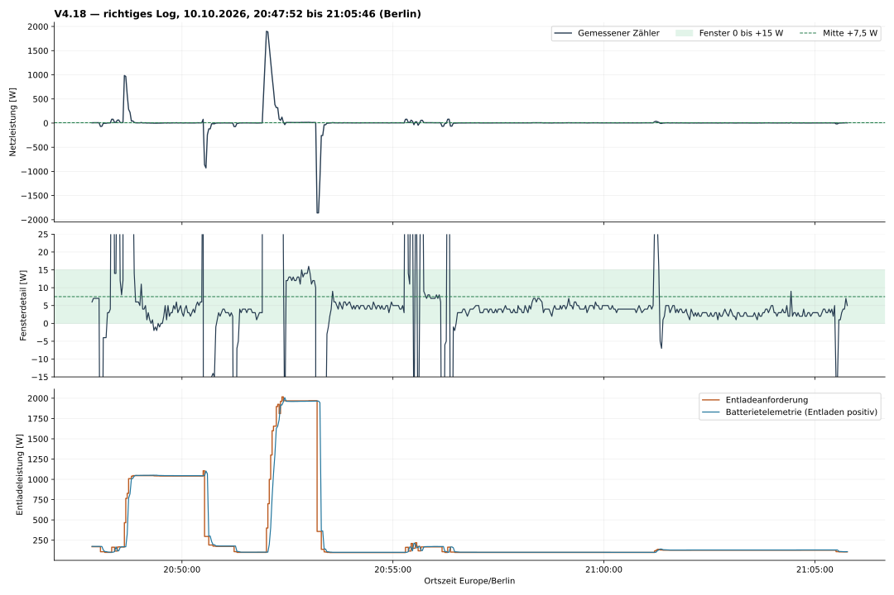
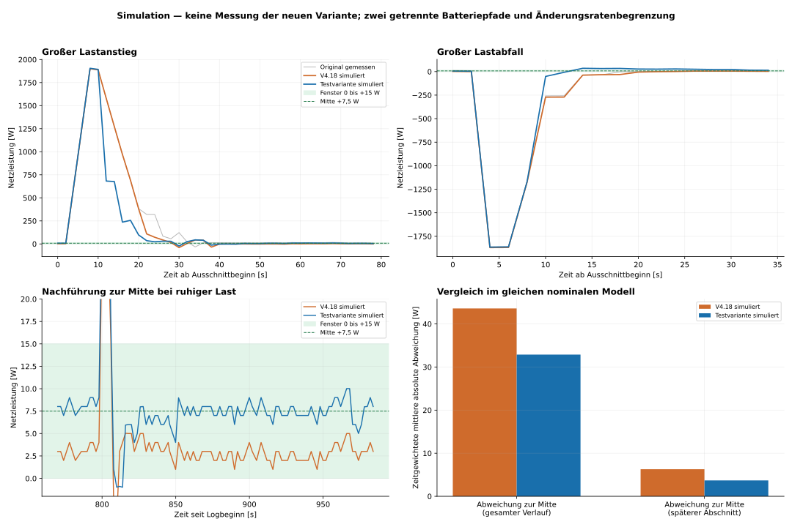

# Prüfung und Simulation des Solarflow-Reglers V4.18

Stand: 10.10.2026. Ausgewertetes Log: `regler_event_log(20261010-190744).jsonl`.
Das zuerst versehentlich bereitgestellte Log wurde für diese Auswertung vollständig ausgeschlossen.

## Ergebnis

Der Regler trifft das breite Fenster häufig, regelt aber seine Mitte nicht dauerhaft aus. Große Lastanstiege führen zu vermeidbar langen Importphasen. Lastabfälle erzeugen zuerst unvermeidbaren Export während der Stellverzögerung und anschließend zusätzlichen Export durch die gedämpfte Korrektur. Eine Erhöhung des P-Anteils oder der Rampe allein löst nicht alle drei Probleme.

Die bereitgestellte **V4.19-SIM ist eine vollständige Testvariante**, die im Modell die Abweichung zur Mitte um 24,6 % senkt und die Import- und Exportenergie reduziert. Sie führt kleine Fehler von der letzten ausgegebenen Anforderung aus zur Mitte nach und wartet nach großen Stelländerungen kurz auf die Batteriereaktion. Die reale Anlage wurde damit nicht getestet; es erfolgte keine Änderung an Home Assistant oder Node-RED. Diese Auswertung und der Testcode werden auf GitHub zur Vorbereitung des Anlagentests bereitgestellt.

## 1. Datenbasis und Sollfenster

- 525 gültige JSON-Zeilen, 20:47:52,104 bis 21:05:46,114 Uhr Europe/Berlin; Dauer 1.074,010 s.
- Durchgehend V4.18, `REGEL_ENTLADEN`, PV = 0 W. Keine Ladephasen, Netzladung oder Richtungswechsel.
- Alle geloggten Snapshots bestehen die Zyklusprüfung und enthalten frische Batteriewerte.
- 13 Zeitabstände über 3 s; größter Abstand 6,002 s. Die Simulation verwendet die tatsächlichen Zeitabstände und hält die Anforderung während der Lücken.
- HTTP-Ereignisse und ACK-Felder sind leer. Das Log beweist die erzeugten Sollwerte, aber nicht deren genaue Sende- und Ausführungszeit an der Batterie.
- Der bereitgestellte Originalcode reproduziert **alle 525 ausgegebenen Sollwerte, Modi, HOLD-Zustände und Integratorzustände exakt**.

| Richtung | Fenster aus dem Log | Berechnete Mitte | Beobachtet? |
|---|---|---|---|
| Laden | −5 bis +15 W | +5 W | Nein |
| Entladen | 0 bis +15 W | +7,5 W | Ja, durchgehend |

Das asymmetrische Fenster ist auf 0 W bezogen importseitig angeordnet. **0 W oder ein negatives Ziel wären hier nicht die geforderte Fenstermitte.** Alle Vergleiche und die Testvariante verwenden +7,5 W; Grenzen und PV-Fensterverschiebungen werden nicht geändert.

## 2. Gemessenes Verhalten

| Kennzahl | Originalmessung |
|---|---:|
| Zeitgewichtete mittlere Netzleistung | +13,54 W |
| Median | +4 W |
| Zeit im Fenster 0 bis +15 W | 83,98 % |
| Zeit oberhalb +15 W | 7,45 % |
| Zeit unterhalb 0 W | 8,57 % |
| Mittlere absolute Abweichung von +7,5 W | 44,88 W |
| Extremwerte | −1.860 / +1.900 W |
| Ruhige, ausgewählte Phasen: Mittelwert | +4,17 W |
| Ruhige Phasen: mittlere absolute Abweichung | 3,74 W |

Die ruhigen Phasen umfassen 388 Punkte beziehungsweise 795,947 s. Auswahl: aktuelle und vier vorausgehende Entladeanforderungen unterscheiden sich um weniger als 2 W; die letzte abgeleitete Hauslaständerung liegt unter 15 W. Diese Auswahl beschreibt das Log, sie ist kein unabhängiger Hauslastsensor.

Die allgemeine Importlastigkeit ist in diesem Ausschnitt überwiegend **dynamisch**: Die großen Lastanstiege dominieren den positiven Gesamtmittelwert. Im ruhigen Betrieb liegt der Regler meist unter der Mitte, während er nach dem großen Lastanstieg zeitweise bei +12 bis +13 W nahe der oberen Kante stehen bleibt. Beide Abweichungen sind mit dem gleichen HOLD-Prinzip vereinbar.

| Ereignis | Zeitpunkt | Reaktion im Log |
|---|---|---|
| Lastanstieg etwa +973 W | 20:48:38 | Zähler +985 W; erster Beginn von drei aufeinanderfolgenden Fensterpunkten nach 14 s |
| Lastabfall etwa −942 W | 20:50:32 | −864 W, anschließend −928 W durch noch ausstehende Stellreaktion; drei Fensterpunkte ab 18 s |
| Lastanstieg etwa +1.897 W | 20:52:00 | +1.900 W; drei Fensterpunkte erst ab 28 s; Zwischenexport −32 W; danach HOLD bei +12/+13 W |
| Lastabfall etwa −1.870 W | 20:53:12 | −1.860 W; erste Anforderung noch 358 W statt rechnerisch etwa 96,5 W; drei Fensterpunkte ab 18 s |

Die Zeiten beziehen sich auf die ersten sichtbaren Messpunkte. Besonders vor 20:52:00 besteht eine 6-s-Lücke; der tatsächliche Beginn der Last liegt darin unbekannt.

## 3. Bewertung des Reglers und seiner Parameter

**Breites HOLD statt Mittenregelung.** Nach zwei Punkten irgendwo im Fenster wird die letzte Anforderung exakt festgehalten. +1 W und +13 W sind damit beide dauerhafte HOLD-Punkte. Der P-Anteil kann diesen Zustand nicht nachträglich zur Mitte verschieben, weil er während HOLD nicht auf die Anforderung wirkt.

**300-W-Aufwärtsrampe ist bei großen Lastanstiegen der Hauptengpass.** Bei einem Sprung um fast 1,9 kW braucht bereits die Rampe mehrere Regeltakte. Hinzu kommen Stell- und Messverzögerungen. Der vorhandene 900-W-Lastsprungpfad wird in diesem Log **kein einziges Mal** aktiviert: Seine Erkennung fordert die aktuelle Richtung LADEN, das Log steht aber ständig auf ENTLADEN.

**P = 0,86 ist eine gedämpfte Korrektur, keine vollständige Bedarfsvorgabe.** Beim großen Lastabfall ergibt sich vereinfacht:

`1964 + 0,86 × (−1860 − 7,5) = 357,95 W`

Der aktuell aus denselben Messwerten abgeleitete Bedarf wäre `1964 −1860 −7,5 = 96,5 W`. Die 14 % verbleibende Korrekturdifferenz erzeugt zunächst rund 261 W zusätzliche Entladeanforderung. Die 2.000-W-Abwärtsrampe ist dabei nicht der Engpass: Sie könnte weiter absenken, der PI-Rohwert verlangt es nur nicht.

**Integrator kann die Mittenabweichung nicht beseitigen.** `iErrMinWDischarge = 16` liegt über jeder möglichen Abweichung von der Mitte innerhalb des 15-W-Fensters. `iMaxWDischarge = 2` begrenzt den Beitrag stark; `iDecayHoldDischarge = 0,28` baut ihn sehr schnell ab. Außerdem ist der Integrator nur positiv. Ein stärkerer dauerhafter I-Anteil wurde im Modell ausprobiert, aber wegen zusätzlicher Schwingneigung verworfen. Er ist nicht die erste Stellschraube.

**Frische Snapshots sind nicht gleichzeitige innere Gerätemessungen.** Während Stelländerungen läuft der Zähler der Batterietelemetrie voraus. Die Identität `p_haus = p_solar + p_zaehler − p_batterie` gilt für die geloggten Zahlen, daraus entsteht aber kein unabhängiger, zeitlich sauberer Hauslastsensor. Beispielsweise wird nach dem großen Lastabfall kurz 779 W Hauslast errechnet, obwohl die benachbarten ruhigen Werte bei ungefähr 105 W liegen. Diese Spitze darf nicht ungeprüft als echter Verbraucher interpretiert werden.

Die Schutzparameter für SOC, Richtungswechsel, Ladebetrieb und hohe PV sind aus diesem Nachtlog nicht zuverlässig optimierbar. Sie bleiben in der Testvariante erhalten.

## 4. Simulationsmodell

Verwendet werden zwei Pfade einer positiven Entladeanforderung `u`:

1. **Wirkung am Zähler:** verzögerter, richtungsabhängiger PT1-Pfad mit begrenzter Änderungsrate. `z = Hauslast − PV − Batterie_am_Zähler`.
2. **Gemeldete Batterieleistung:** eigener verzögerter Pfad mit getrennten Antworten auf positive und negative Anforderungsänderungen. Der Regler erhält deren negative Leistung als `p_batterie`.

Nominale, effektive Parameter:

| Modellpfad | Anstieg | Rücknahme |
|---|---:|---:|
| Wirkung am Zähler: Verzögerung | ca. 2,00 s | ca. 2,84 s |
| Wirkung am Zähler: PT1-Zeitkonstante | ca. 0,19 s | ca. 0,27 s |
| Wirkung am Zähler: maximale Änderungsrate | ca. 1.000 W/s | ca. 595 W/s |
| Batterietelemetrie: Verzögerung | ca. 3,55 s | ca. 3,98 s |
| Batterietelemetrie: Zeitkonstante | ca. 0,19 s | ca. 0,35 s |

Das sind **effektive Modellwerte**, keine nachgewiesenen Firmware- oder Hardwareparameter. Sie enthalten Befehlslaufzeit, Abtastung und geräteinterne Verarbeitung. Einige Zeitkonstanten und Verzögerungen lassen sich bei 2-s-Abtastung nicht getrennt exakt identifizieren.

Die Netzleistungswirkung wird unter der Annahme überwiegend stückweise konstanter Hauslast identifiziert. Aus der simulierten Wirkung der originalen Anforderungen wird anschließend eine angenäherte äußere Last rekonstruiert. Das abschließend verwendete Modell erzeugt dabei 101 bis 2.000 W Last und keine unphysikalisch negative Last. Das feste Wiederverwenden des ursprünglichen Zählers oder des ursprünglichen, batterieabhängig abgeleiteten `p_haus` wäre eine falsche Simulation.

Die ersten 110 Punkte einschließlich des ersten Lastzyklus von rund 1 kW dienen zur Modellkalibrierung. Die Batterietelemetrie weist dort etwa 15,9 W RMSE auf, im folgenden, größeren Lastzyklus und restlichen Verlauf etwa 29,3 W RMSE; im gesamten Verlauf beträgt die mittlere absolute Telemetrieabweichung etwa 5,9 W. Der zweite Lastzyklus wurde zum Vergleichen und Verwerfen ungeeigneter Reglerkandidaten verwendet. **Damit ist er keine abschließende, unabhängige Prüfung der ausgewählten Variante.** Die Zählerdynamik besitzt ebenfalls keinen unabhängig gemessenen Hauslastverlauf als Referenz.

Zusätzlich wurden fünf Modellvarianten gerechnet: nominal; gemeinsame zusätzliche Verzögerung +0,5 s; −0,4 s; langsamerer und schnellerer Pfad mit um 25 % beziehungsweise 20 % veränderten Zeitkonstanten und entsprechend veränderter Änderungsrate. Diese Fälle sind Sensitivitätstests, keine statistischen Konfidenzintervalle.

## 5. Ausgewählte Testvariante V4.19-SIM

Die Änderungen sind auf **PV ≤50 W** beschränkt. Beobachtet wurde nur 0 W; die 50-W-Grenze dient der klaren Abgrenzung des Nachtbereichs. Oberhalb davon bleiben die ursprünglichen Lade- und Entladeregler aktiv.

| Einstellung | V4.18 | Testvariante im Nachtbereich | Zweck |
|---|---:|---:|---|
| Normaler Entlade-P-Anteil | 0,86 | 0,80 | Weniger Rückkopplung aus zeitlich versetzten Messungen |
| Aufwärtsrampe normal | 300 W/Tick | 1.200 W/Tick | Großen Leistungsbedarf zügig anfordern |
| Warten auf ausstehende große Reaktion | keine eigene Wartebedingung | bis 6 s bei mehr als 180 W Untertracking und Import oberhalb des Fensters | Wiederholte Korrektur derselben ausstehenden Reaktion verhindern |
| Starker Export | P = 0,86 | P = 1,00 unterhalb der unteren Fenstergrenze minus 150 W, nur bei Tracking oder vorhandener Exportbestätigung | Lastabfälle vollständiger korrigieren |
| HOLD | gesamtes Fenster | innerhalb des Fensters und Mitte ±2 W, Trackingabweichung höchstens 20 W | Mitte statt beliebiger Fensterkante halten |
| Feinführung | Batterie-Istbasis | letzte ausgegebene Anforderung, bei höchstens 30 W Mittenfehler | Kleine Fehler ohne Telemetrieoffset ausregeln |
| Kleine Stelländerung | normale PI-Anforderung | höchstens 2 W im Fenster, 6 W nahe außerhalb; mindestens 6 s nach letzter Änderung | Nachschwingen begrenzen |
| I-Anteil, SOC, Richtungslogik | bestehend | unverändert | Keine unbelegte globale Anpassung |

Die Feinführung kann auch knapp außerhalb des ursprünglichen Fensters aktiv sein. **Das erweitert das Sollfenster nicht:** Dort wird weiter zur Mitte korrigiert und niemals HOLD gemeldet. Die vorsichtigen Schritte können kleine Grenzüberschreitungen länger bestehen lassen; das ist der bewusst getestete Kompromiss zur Vermeidung größerer Gegenspitzen.

Schnellere oder stärkere Kandidaten waren im nominalen Modell teilweise besser, erzeugten jedoch bei verzögerter Stellreaktion größere Gegenspitzen. Die ausgewählte Kombination senkt die Exportenergie in allen fünf untersuchten Modellen. Die zusätzliche negative Gegenspitze nach Lastanstiegen beträgt im schlechtesten Paarvergleich etwa 6,6 W; die festgelegte Auswahlgrenze war 30 W. Eine allgemeine Zusicherung gegen jedes Überschwingen folgt daraus nicht.

## 6. Ergebnis im gleichen nominalen Modell

Die linke Spalte ist eine Simulation von V4.18, nicht die Originalmessung. Nur dieser Vergleich hält Modell und äußere Last konstant.

| Kennzahl | V4.18 simuliert | Testvariante simuliert |
|---|---:|---:|
| Mittlere absolute Abweichung zur Mitte | 43,60 W | 32,88 W |
| Mittlerer Netzbezug im späteren Abschnitt | 3,44 W | 7,35 W |
| Importenergie, geschätzt | 7,95 Wh | 7,06 Wh |
| Exportenergie, geschätzt | 4,78 Wh | 4,28 Wh |
| Zeit im ursprünglichen Fenster | 83,24 % | 81,56 % |
| Mittlere Netzleistung insgesamt | 10,61 W | 9,32 W |

Die Abweichung sinkt nominal um 24,6 %, Importenergie um 11,2 % und Exportenergie um 10,6 %. Der spätere Abschnitt mit überwiegend kleinen Laständerungen liegt bei +7,35 W statt +3,44 W. Über alle fünf Modellvarianten liegt dieser Mittelwert zwischen +6,49 und +7,35 W.

**Nicht jede Kennzahl verbessert sich:** Der Zeitanteil im gesamten 15-W-Fenster fällt im nominalen Modell von 83,24 auf 81,56 %. Kleinere Grenzüberschreitungen dauern durch die langsame Feinführung teilweise länger, während die Mittenabweichung und Energie der großen Fehler kleiner werden. Der vollständige Verlauf bleibt wegen der Lastsprünge im Mittel oberhalb +7,5 W. Ein verschobener Sollwert wurde nicht zum Kaschieren dieser Restabweichung benutzt.

## 7. Grenzen und praktische Einordnung

- Das Modell ist für die protokollierte Entladung ohne PV und Lasten bis etwa 2 kW brauchbar zum Vergleichen. Tagesbetrieb, Laden, PV-Sprünge und Richtungswechsel sind dadurch nicht validiert.
- Ein Lastsprung kann vor seinem Messpunkt nicht erkannt werden. Die ersten Import- beziehungsweise Exportspitzen während Befehls- und Gerätereaktion lassen sich ohne vorausschauende Lastinformation nicht vollständig verhindern.
- Der Telemetriefehler des Modells ist größer als das gewünschte Feinfenster. Prozentwerte sind bedingte Simulationsergebnisse, keine Prognose mit derselben Genauigkeit für die reale Anlage.
- Energie und Zeitanteile nutzen den letzten Wert bis zum nächsten Punkt. Beim gemessenen Original ergeben sich so etwa 8,78 Wh Import und 4,74 Wh Export. Trapezförmige Interpolation ergibt etwa 9,84 beziehungsweise 4,74 Wh; die Unsicherheit liegt besonders an der 6-s-Lücke vor dem großen Lastanstieg.
- Die sinnvolle nächste reale Prüfung wäre derselbe Lastablauf mit aktivem HTTP-Sende-/ACK-Log und anschließendem Nachtverlauf. Für die Tagesoptimierung ist ein entsprechendes PV-/Ladelog erforderlich.

## 8. Dateien und Prüfung

`Regler_V4_19_SIM.js` ist der komplette Funktionsinhalt für den vorhandenen Node mit vier Ausgängen. Das Einfügen ersetzt nur dessen Code; keine zusätzliche Verdrahtung ist erforderlich. Die Änderung wurde hier nicht an der Anlage angewendet.

14 Prüfgruppen bestehen: exakte Originalwiedergabe; Übereinstimmung des finalen Codes mit dem ausgewählten Simulationskandidaten in allen fünf Modellen; unveränderte Ausgänge außerhalb des Optimierungsbereichs; falsche/alte Snapshots; OFF; bestätigtes SOC-Minimum; Entladesperre; volle Batterie/Netzladung; Batterie-Hold; ein negatives asymmetrisches Fenster; Modellbegrenzung; kurze Lastpulse, Teilabfälle und Last oberhalb der Ausgangsgrenze. Die synthetische 2,6-kW-Last prüft nur Ausgangsbegrenzung und Plausibilität, keine validierte Anlagenreaktion außerhalb des Messbereichs.

Der veröffentlichte Ordner enthält den vollständigen Testcode, eine bytegleiche TXT-Kopie, die ausgewählten Reglerparameter, diese Analyse und beide Abbildungen. Die privaten Rohlogs und Anlagenexporte sind nicht Bestandteil des Repositorys. Das separat bereitgestellte Simulationspaket enthält zusätzlich Originalcode, das richtige Log, Modellparameter, Vergleichsdaten und die ausführbare Simulation; darin reproduziert `python reproduce.py` den Vergleich und die Prüfungen, `python search.py` die abschließend untersuchten Parameterkombinationen. Voraussetzungen für dieses Paket: Python mit numpy/scipy/matplotlib sowie Node.js.

SHA-256 Originalcode: `590b11654eeac2086e7007d8667937dfd7158d04bb92aa5565d16714d3076bbe`

SHA-256 richtiges Log: `3e830bbea688ffe4837c9c262edfb7376d29318ae06ab1d232cc1689f74897c2`
