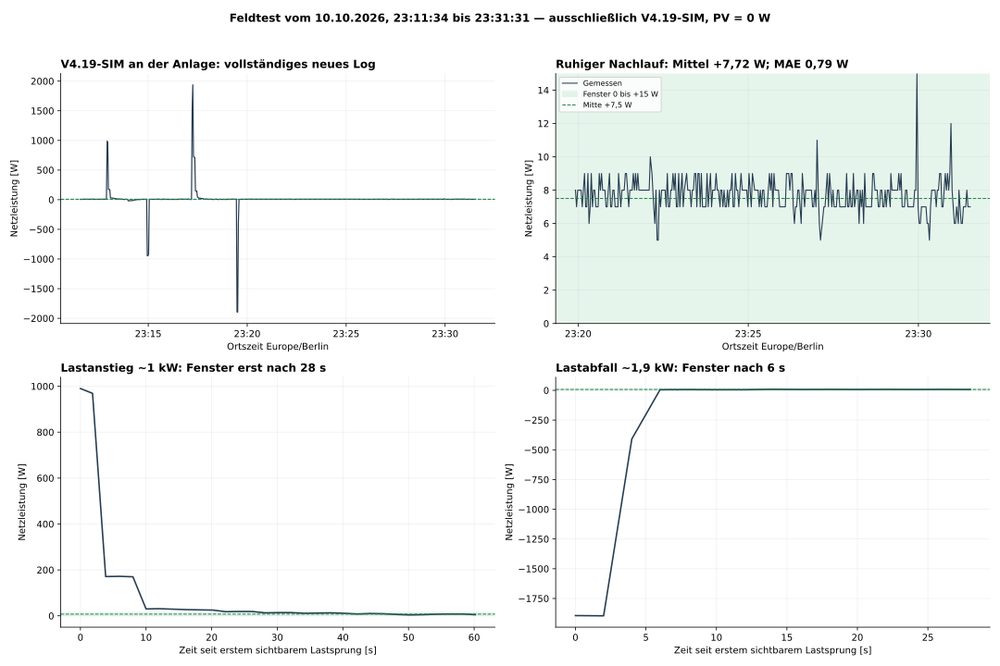
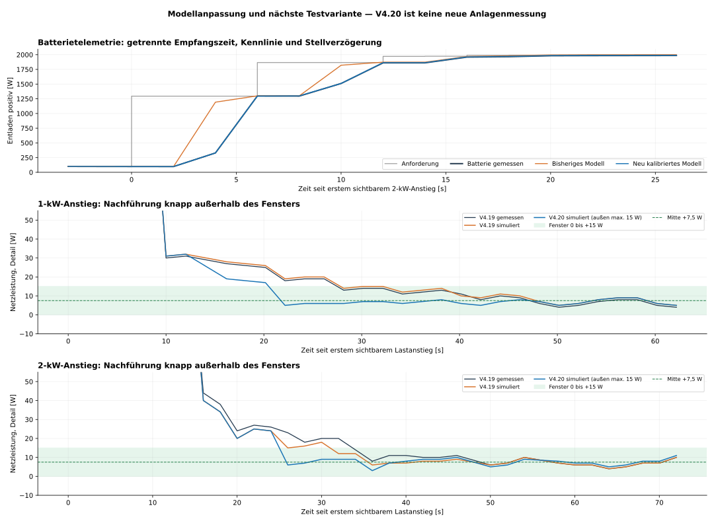

# Regulator V4.20-SIM: next candidate after the V4.19 field log

**English** | [Deutsch](README_DE.md)

V4.19-SIM was observed at the installation in an approximately 20-minute
night log. Midpoint tracking works: the last quiet section averages +7.72 W,
with a mean absolute deviation of 0.79 W from the +7.5 W midpoint.
It stays within the original 0 to +15 W window throughout that section.
Large load decreases return to the window after about 6 s; load increases
still require approximately 28 and 34 s.

**V4.20-SIM is a new simulated candidate. Its own installation test is pending.**
It changes only `centerTrimMaxOutsideStepW` from 6 to 15 W, allowing the
fine adjustment to remove the small remaining import outside the window
more quickly. Inside the window, the 2 W maximum adjustment, 6 s wait and
midpoint ±2 W HOLD condition remain. Window, SOC locks, direction handling
and the four Function outputs remain unchanged.

## Files

- [Complete Function source](Regler_V4_20_SIM.js)
- [Identical text copy for pasting](Regler_V4_20_SIM.txt)
- [Detailed field-test and model analysis, German](Regler_Feldtest_Analyse_DE.md)
- [Updated model parameters](Regler_Modell_V2.json)
- [Regulator parameters and change scope](Regler_Parameter.json)
- [Measured and simulated results](Regler_Feldtest_Ergebnisse.json)
- [Previous V4.19 candidate](../v4.19-sim/README.md)

## Model and limitations

The updated model uses separate grid/battery receive timestamps,
direction-dependent rate-limited responses, a battery telemetry curve and
episode-specific effective delays. The full calibration uses the whole night
log. Its small fitting error is not independent validation of future command
sequences. Actual HTTP send/ACK/application times are still empty in the log;
the external house load is reconstructed.

Across both correct logs and eight model cases per log, the small change
reduces mean absolute deviation. In the nominal new model, window recovery
after load increases is about 6 s earlier, with an overall MAE reduction of
about 1.5%. One sensitivity comparison shows a secondary negative peak
up to 9 W larger. Improvement of every individual peak is therefore not
established. Larger general P/ramp increases are not recommended.

Quiet operation is close to a useful practical limit. A global natural limit
for load changes is not established: the first unknown load impulse cannot
be anticipated, while part of the subsequent import tail comes from the
chosen controller parameters.

## Test in Node-RED

1. Back up the existing V4.19 Function.
2. Paste the complete `.txt` or `.js` content into that Function. Keep the
   four outputs, connections and existing flow variables.
3. Repeat the night load sequence with approximately 1 kW and 2 kW, allowing
   settling between changes. Then record at least 30 minutes of quiet operation.
4. Compare recovery into the original window, opposite peaks and error energy.
   The target remains the actual window midpoint, +7.5 W.
5. Add actual send/response/application timestamps to the write path where
   the device interface supplies them. The existing write logic must be
   inspected separately for this change.

Nine test groups pass, including measured replay, equality of the complete
V4.20 file and candidate across all 16 model cases, snapshot, SOC, grid-charge
and output bounds. Both logs contain only PV = 0 W and discharging. Charging,
PV changes and direction/SOC transitions remain unvalidated in the field.
The additional 2.6 kW simulation checks only output bounds.

The private reproduction package contains both correct logs and the model/
simulation scripts. Raw logs and installation exports are not included in
this public repository. This regulator revision is separate from efficiency
release v5.1.0.
