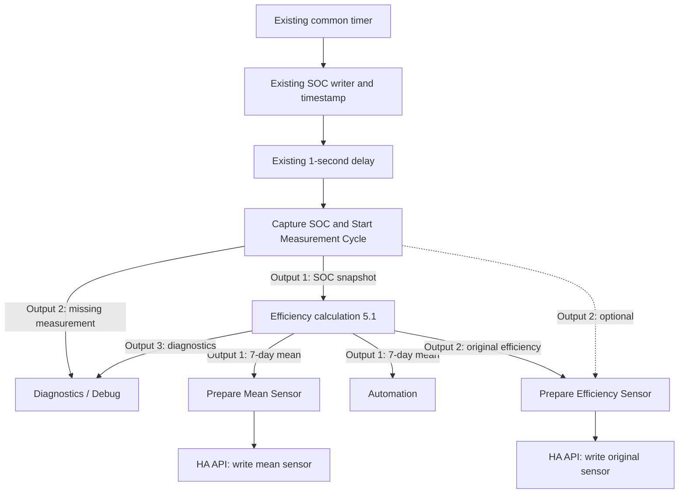

# Wiring – v5.1.0 / calculation revision 5.1

**English** | [Deutsch](WIRING_DE.md)

Use the existing common timer. SOC and its original Unix-millisecond timestamp are written about one second before preparation. The snapshot builder runs in the existing measurement branch and must have written its complete power snapshot to flow context before calculation. No additional connection from snapshot output 11 is needed with this timer path.

The dashed warning connection is optional and absent from the default import. No warning connection enters the mean sensor path. The manual Inject button in the import has no periodic or startup trigger. Connect the existing delayed cycle to preparation; do not add another repeating timer.

| Node | Outputs / configuration |
| --- | --- |
| SOC preparation | 2 outputs: calculation / diagnostics |
| Calculation | 3 outputs: mean / original / diagnostics |
| Each sensor preparation | 1 output: request object to its API node |
| Each API node | HTTP POST; existing HA server; response in `msg.ha_state` |
| API/formatting Catch | Diagnostics only |

Branch automation directly from calculation output 1, before API preparation changes the payload. During a short source failure, valid retained mean history continues on output 1, with `source_valid: false`; new collection pauses. The clock continues to expire old intervals. The original output may be null. Without remaining valid mean history, the mean also becomes unknown.

Configure sensor entity IDs in the `SENSOR` block of the preparation nodes. Defaults: `sensor.battery_efficiency_mean_7d` and `sensor.battery_efficiency`. No Companion integration is required. These API writes create sensor states without their own entity-registry entry/unique ID; the next successful write recreates them after HA restart. See [installation and sensor details](README.md).
