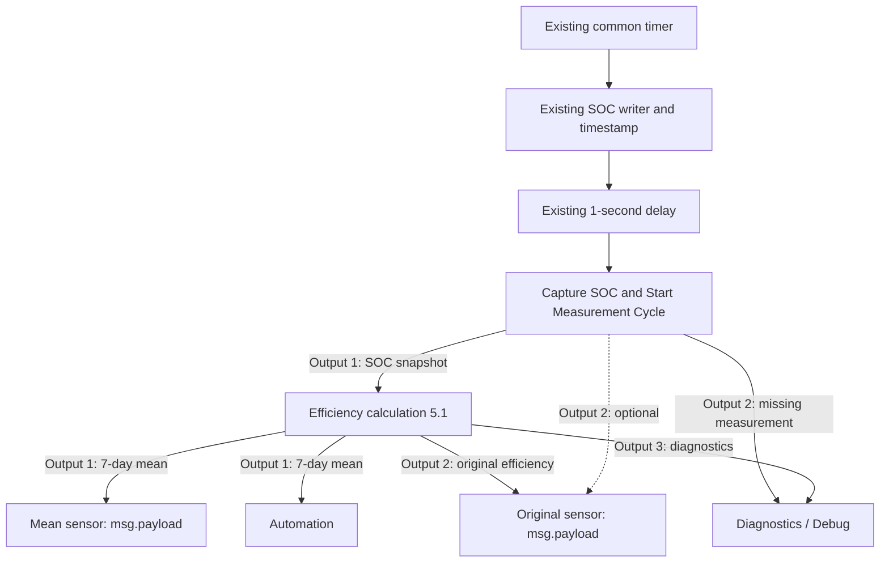

# Wiring – v5.1.0 / calculation revision 5.1

**English** | [Deutsch](WIRING_DE.md)

Use the existing common timer. SOC and its original Unix-millisecond timestamp are written about one second before preparation. The snapshot builder runs in the existing measurement branch and must have written its complete power snapshot to flow context before calculation. No additional connection from snapshot output 11 is needed with this timer path.

The dashed warning connection is optional and absent from the default import. No warning connection enters the mean sensor path. The manual Inject button in the import has no periodic or startup trigger. Connect the existing delayed cycle to preparation; do not add another repeating timer.

| Node | Outputs / configuration |
| --- | --- |
| SOC preparation | 2 outputs: calculation / diagnostics |
| Calculation | 3 outputs: mean / original / diagnostics |
| Both ha-sensor nodes | State = `msg.payload`; `%`; no attributes/output properties |
| Each Entity config | Separate sensor identity; existing HA server; resend/debug disabled |
| Sensor Catch | Diagnostics only |

Branch automation directly from calculation output 1. Both sensors also receive their numeric payloads directly; no preparation Function is required. During a short source failure, valid retained mean history continues on output 1, with `source_valid: false`; new collection pauses. The clock continues to expire old intervals. The original output may be null. Without remaining valid mean history, the mean also becomes unknown.

For an existing installation, import only [sensor-mean.json](sensor-mean.json). Keep the existing sensor/Entity config and use the new separate Entity config for the mean. Select the existing server in each configuration. Requires `hass-node-red` Companion integration 1.1.0+; the new entity's actual HA ID is obtained from HA. Release 5.1.0 / calculation 5.1 stay unchanged; use current `main` imports instead of the original API-based release snapshot. See [installation and sensor details](README.md).
