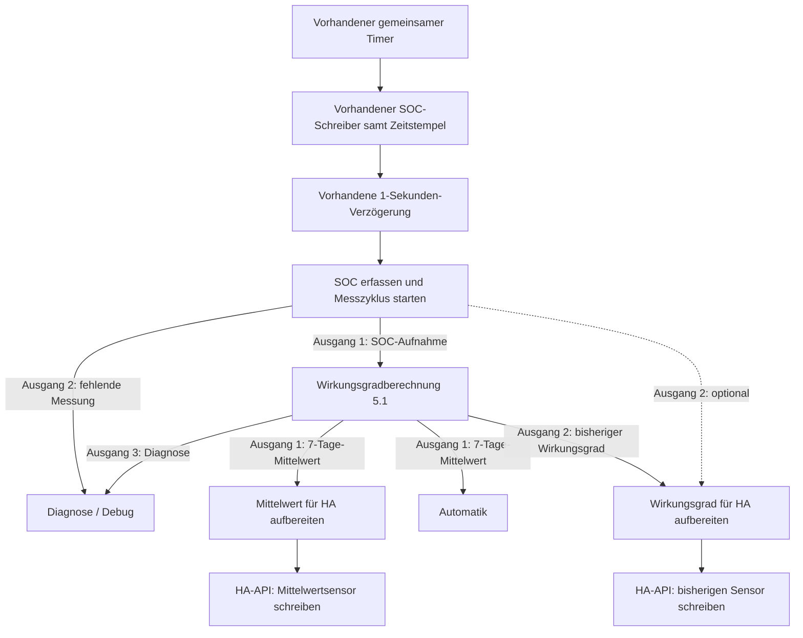

# Verdrahtung – v5.1.0 / Berechnungsrevision 5.1

[English](WIRING.md) | **Deutsch**

Den vorhandenen gemeinsamen Timer verwenden. SOC und originaler Unix-Zeitstempel in Millisekunden werden etwa eine Sekunde vor der Vorbereitung geschrieben. Der Snapshot-Builder läuft im bestehenden Messzweig und muss seinen vollständigen Leistungs-Snapshot vor der Berechnung im Flow-Kontext abgelegt haben. Beim vorhandenen Timer-Pfad ist kein zusätzlicher Anschluss von Snapshot-Ausgang 11 erforderlich.

Die gestrichelte Warnungsverbindung ist optional und im Standardimport nicht vorhanden. Kein Warnungskabel führt zum Mittelwertsensor. Der manuelle Inject-Knopf im Import besitzt weder Wiederholung noch Startimpuls. Den vorhandenen verzögerten Takt an die Vorbereitung anschließen; keinen weiteren periodischen Timer ergänzen.

| Node | Ausgänge / Einstellung |
| --- | --- |
| SOC-Vorbereitung | 2 Ausgänge: Berechnung / Diagnose |
| Berechnung | 3 Ausgänge: Mittelwert / bisheriger Wert / Diagnose |
| Jede Sensor-Aufbereitung | 1 Ausgang: Anfrageobjekt an ihren API-Node |
| Jeder API-Node | HTTP POST; vorhandener HA-Server; Antwort in `msg.ha_state` |
| Catch für API-/Aufbereitungsfehler | Nur Diagnose |

Die Automatik direkt von Berechnungsausgang 1 abzweigen, bevor die API-Aufbereitung die Nutzlast ändert. Bei kurzem Quellausfall bleibt gültige Mittelwerthistorie an Ausgang 1 verfügbar, mit `source_valid: false`; neue Aufnahme pausiert. Altdaten laufen weiter zeitabhängig aus. Der bisherige Ausgang darf null sein. Ohne verbleibende gültige Mittelwerthistorie wird auch der Mittelwert unbekannt.

Sensor-Entitäts-IDs im Block `SENSOR` der Aufbereitungsnodes einstellen. Vorgaben: `sensor.battery_efficiency_mean_7d` und `sensor.battery_efficiency`. Keine Companion-Integration erforderlich. Die API schreibt Sensorzustände ohne eigenen Entitätsregistereintrag/Unique-ID; nach HA-Neustart stellt das nächste erfolgreiche Schreiben sie wieder her. Siehe [Installation und Sensor-Anbindung](README_DE.md).
