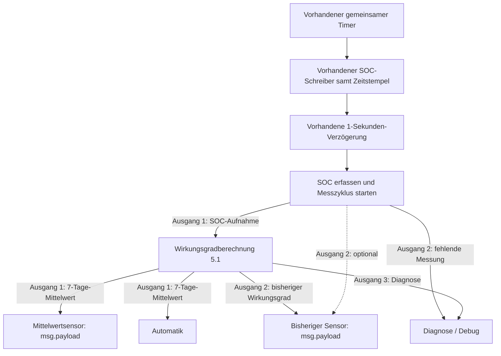

# Verdrahtung – v5.1.0 / Berechnungsrevision 5.1

[English](WIRING.md) | **Deutsch**

Den vorhandenen gemeinsamen Timer verwenden. SOC und originaler Unix-Zeitstempel in Millisekunden werden etwa eine Sekunde vor der Vorbereitung geschrieben. Der Snapshot-Builder läuft im bestehenden Messzweig und muss seinen vollständigen Leistungs-Snapshot vor der Berechnung im Flow-Kontext abgelegt haben. Beim vorhandenen Timer-Pfad ist kein zusätzlicher Anschluss von Snapshot-Ausgang 11 erforderlich.

Die gestrichelte Warnungsverbindung ist optional und im Standardimport nicht vorhanden. Kein Warnungskabel führt zum Mittelwertsensor. Der manuelle Inject-Knopf im Import besitzt weder Wiederholung noch Startimpuls. Den vorhandenen verzögerten Takt an die Vorbereitung anschließen; keinen weiteren periodischen Timer ergänzen.

| Node | Ausgänge / Einstellung |
| --- | --- |
| SOC-Vorbereitung | 2 Ausgänge: Berechnung / Diagnose |
| Berechnung | 3 Ausgänge: Mittelwert / bisheriger Wert / Diagnose |
| Beide ha-sensor-Nodes | State = `msg.payload`; `%`; keine Attribute/Ausgabefelder |
| Jede Entity config | Eigene Sensoridentität; vorhandener HA-Server; Resend/Debug aus |
| Catch für Sensorfehler | Nur Diagnose |

Die Automatik direkt von Berechnungsausgang 1 abzweigen. Beide Sensoren erhalten ihre numerischen Nutzlasten ebenfalls direkt; ein Aufbereitungsnode entfällt. Bei kurzem Quellausfall bleibt gültige Mittelwerthistorie an Ausgang 1 verfügbar, mit `source_valid: false`; neue Aufnahme pausiert. Altdaten laufen weiter zeitabhängig aus. Der bisherige Ausgang darf null sein. Ohne verbleibende gültige Mittelwerthistorie wird auch der Mittelwert unbekannt.

Bei bestehender Installation nur [sensor-mean_DE.json](sensor-mean_DE.json) importieren. Bisherigen Sensor samt Entity config beibehalten; für den Mittelwert die neue eigene Entity config nutzen. In jeder Konfiguration den vorhandenen Server auswählen. Benötigt `hass-node-red` Companion-Integration 1.1.0+; die tatsächliche neue HA-Entitäts-ID aus HA übernehmen. Release 5.1.0 / Berechnung 5.1 bleiben gleich; aktuelle `main`-Importe statt des ursprünglichen API-basierten Release-Stands verwenden. Siehe [Installation und Sensor-Anbindung](README_DE.md).
